# TBET Intent Loop Prevention & Conversation Closure

**Preventing infinite loops when DIDs send TBET intents to each other**

Version: 1.0.0
Date: 2025-11-27

---

## 🔄 The Loop Problem

### Scenario: Oneindige Intent Loop

```
Bank DID stuurt TBET → Customer DID
Customer DID reageert TBET → Bank DID
Bank DID reageert TBET → Customer DID
Customer DID reageert TBET → Bank DID
...
∞ LOOP!
```

**Gevolgen:**
- ❌ DDoS attack vector
- ❌ Resource exhaustion
- ❌ Costs explosion (opslag, processing)
- ❌ User confusion (oneindig bellen!)

**We moeten:**
1. ✅ Intent loops detecteren VOORDAT ze ontstaan
2. ✅ Maximum reply depth enforc en
3. ✅ Conversation state bijhouden
4. ✅ Clean closure mechanisme
5. ✅ Re-engagement flow voor vervolggesprekken

---

## 🛡️ Solution 1: Intent Direction Flag

### Initiator vs Responder Rule

**Regel:** Alleen de **initiator** van een FIR/A mag TBET intents sturen.

```python
class FIRARelationship:
    """FIR/A met directional intent rules"""

    def __init__(self, initiator, responder):
        self.initiator = initiator  # Mag intents sturen
        self.responder = responder  # Mag ALLEEN reageren (niet nieuwe intents)

        self.intent_direction = "initiator_to_responder"  # One-way
        self.conversation_state = "active"

    def send_intent(self, sender, intent, context):
        """Valideer wie de intent mag sturen"""

        # Check: Is sender de initiator?
        if sender != self.initiator:
            raise IntentDirectionError(
                f"Only initiator ({self.initiator}) can send intents. "
                f"Sender {sender} is responder and cannot initiate intents."
            )

        # Check: Conversation nog actief?
        if self.conversation_state == "closed":
            raise ConversationClosedError(
                "Conversation is closed. Create new FIR/A for re-engagement."
            )

        # OK - process intent
        return self._process_intent(intent, context)
```

**Voorbeeld:**

```python
# Bank creates FIR/A (bank = initiator)
fir_a = client.init_relationship(
    initiator="ing_bank",        # ← Mag intents sturen
    responder="customer_phone",  # ← Mag ALLEEN reageren
    ...
)

# ✅ Bank kan intents sturen
bank.send_intent(fir_a.id, "financial_advice", {...})

# ❌ Customer kan GEEN intents sturen (alleen reageren)
customer.send_intent(fir_a.id, "question", {...})
# → IntentDirectionError: Only initiator can send intents

# ✅ Customer kan WEL reageren via response
customer.send_response(fir_a.id, "accepted", {"answer": "..."})
```

---

## 🔢 Solution 2: Maximum Reply Depth

### Reply Chain Limiting

**Regel:** Maximum aantal replies per conversation = **5**

```python
class ConversationDepth:
    """Track conversation depth to prevent loops"""

    def __init__(self, max_depth=5):
        self.max_depth = max_depth
        self.current_depth = 0
        self.conversation_events = []

    def add_intent(self, intent_type, sender):
        """Add intent and check depth"""

        self.current_depth += 1
        self.conversation_events.append({
            "seq": self.current_depth,
            "type": intent_type,
            "sender": sender,
            "timestamp": datetime.utcnow()
        })

        if self.current_depth > self.max_depth:
            raise MaxDepthExceededError(
                f"Conversation depth limit reached ({self.max_depth}). "
                "Close this conversation and create new FIR/A if needed."
            )

    def add_response(self, response_type, sender):
        """Responses don't increase depth (maar we tracken wel)"""

        self.conversation_events.append({
            "seq": self.current_depth,
            "type": f"response_{response_type}",
            "sender": sender,
            "timestamp": datetime.utcnow(),
            "is_response": True  # Not counted towards depth
        })
```

**Voorbeeld conversatie:**

```
Depth 1: Bank → Intent: "financial_advice" (appointment request)
         Customer → Response: "accepted" (appointment scheduled)

Depth 2: Bank → Intent: "send_documents" (docs needed)
         Customer → Response: "documents_uploaded"

Depth 3: Bank → Intent: "review_complete" (review done)
         Customer → Response: "acknowledged"

Depth 4: Bank → Intent: "offer_mortgage" (official offer)
         Customer → Response: "accepted"

Depth 5: Bank → Intent: "finalize_contract" (last step)
         Customer → Response: "signed"

Depth 6: Bank → Intent: "..."
         ❌ MaxDepthExceededError!
         Router: "Conversation limit reached. Close and create new FIR/A."
```

**Waarom 5?**
- De meeste conversations zijn < 5 exchanges
- Voorkomt oneindige loops
- Forces clean closure
- Voor complexe zaken → nieuwe FIR/A met reference

---

## ⏱️ Solution 3: Time-Based Conversation Expiry

### Automatic Expiry

**Regel:** Conversations expiren na **timebox** (default 24u na laatste activiteit)

```python
class ConversationTimebox:
    """Time-based conversation expiry"""

    def __init__(self, timebox_hours=24, appointment_based=False):
        self.timebox_hours = timebox_hours
        self.appointment_based = appointment_based

        self.created_at = datetime.utcnow()
        self.last_activity = datetime.utcnow()
        self.expires_at = None

        if appointment_based:
            # Appointment-based: expires when appointment window closes
            self.expires_at = self.calculate_appointment_expiry()
        else:
            # Activity-based: expires after timebox of inactivity
            self.expires_at = self.last_activity + timedelta(hours=timebox_hours)

    def update_activity(self):
        """Update last activity and extend expiry"""
        self.last_activity = datetime.utcnow()

        if not self.appointment_based:
            # Extend expiry for activity-based
            self.expires_at = self.last_activity + timedelta(hours=self.timebox_hours)

    def is_expired(self):
        """Check if conversation expired"""
        return datetime.utcnow() > self.expires_at

    def time_remaining(self):
        """Time until expiry"""
        remaining = self.expires_at - datetime.utcnow()
        return remaining if remaining.total_seconds() > 0 else timedelta(0)
```

**Types of expiry:**

### A) Activity-Based Expiry (Level 0-2)

```python
# Personal/business calls: 24h inactivity
fir_a = create_relationship(
    initiator="friend",
    responder="me",
    timebox_hours=24,
    appointment_based=False
)

# After 24h of no activity → auto-expire
# Customer kan altijd nieuwe FIR/A starten
```

### B) Appointment-Based Expiry (Level 3-5)

```python
# Bank call: expires when appointment window closes
fir_a = create_relationship(
    initiator="bank",
    responder="customer",
    appointment_start="2025-11-27T14:30:00Z",
    appointment_end="2025-11-27T15:00:00Z",
    appointment_based=True
)

# Expires at: 2025-11-27T15:00:00Z (appointment end)
# After that → closed, nieuwe FIR/A needed
```

---

## 🏁 Solution 4: Conversation Closure

### Explicit Closure

**Proper afronding van een conversatie:**

```python
class ConversationClosure:
    """Manage conversation closure"""

    closure_types = {
        "completed": "Conversation successfully completed",
        "expired": "Timebox expired",
        "max_depth": "Maximum conversation depth reached",
        "user_terminated": "User ended conversation",
        "error": "Error occurred, conversation aborted"
    }

    def close_conversation(self, fir_a_id, closure_type, summary=None):
        """
        Close conversation and create closure event

        Args:
            fir_a_id: FIR/A relationship ID
            closure_type: One of closure_types
            summary: Optional summary of conversation outcome
        """
        fir_a = get_fir_a(fir_a_id)

        # Create closure event
        closure_event = {
            "type": "conversation_closure",
            "fir_a_id": fir_a_id,
            "closure_type": closure_type,
            "closure_reason": self.closure_types[closure_type],
            "timestamp": datetime.utcnow().isoformat(),
            "conversation_summary": summary or self.generate_summary(fir_a),
            "total_events": len(fir_a.events),
            "conversation_duration_seconds": self.calculate_duration(fir_a),
            "outcome": self.assess_outcome(fir_a)
        }

        # Add to event chain
        fir_a.add_event(closure_event)

        # Update state
        fir_a.conversation_state = "closed"
        fir_a.closed_at = datetime.utcnow()

        # Generate re-engagement offer if applicable
        if self.needs_followup(fir_a):
            re_engagement_offer = self.create_reengagement_offer(fir_a)
            closure_event["re_engagement_offer"] = re_engagement_offer

        return closure_event

    def generate_summary(self, fir_a):
        """AI-generated summary van conversatie"""

        events = fir_a.events
        intents = [e for e in events if e["type"] == "ift"]
        responses = [e for e in events if e["type"].startswith("response")]

        summary = {
            "total_intents": len(intents),
            "total_responses": len(responses),
            "intent_types": [i["intent"] for i in intents],
            "outcome_status": self.assess_outcome(fir_a),
            "humotica_trace": self.extract_humotica_trace(events)
        }

        return summary

    def assess_outcome(self, fir_a):
        """Beoordeel outcome van conversatie"""

        last_event = fir_a.events[-1]

        if last_event.get("type") == "response_accepted":
            return "success"
        elif last_event.get("type") == "response_rejected":
            return "rejected"
        elif "signed" in str(last_event):
            return "completed_with_signature"
        else:
            return "incomplete"

    def needs_followup(self, fir_a):
        """Bepaal of vervolg nodig is"""

        outcome = self.assess_outcome(fir_a)

        # Incomplete conversations → offer followup
        if outcome in ["incomplete", "rejected"]:
            return True

        # Check for pending items in humotica
        humotica = self.extract_humotica_trace(fir_a.events)
        if "follow-up required" in humotica.lower():
            return True

        return False

    def create_reengagement_offer(self, fir_a):
        """Maak re-engagement offer voor vervolg"""

        return {
            "type": "re_engagement_offer",
            "previous_fir_a_id": fir_a.id,
            "reason": "Follow-up required based on conversation outcome",
            "suggested_timeslot_offset_hours": 24,  # Volgende dag
            "suggested_intent": "follow_up_discussion",
            "context_from_previous": {
                "summary": self.generate_summary(fir_a),
                "open_items": self.extract_open_items(fir_a)
            }
        }
```

### Closure Event in Chain

```json
{
  "seq": 12,
  "type": "conversation_closure",
  "closure_type": "completed",
  "timestamp": "2025-11-27T15:30:00Z",

  "conversation_summary": {
    "total_intents": 5,
    "total_responses": 5,
    "intent_types": [
      "financial_advice",
      "send_documents",
      "review_complete",
      "offer_mortgage",
      "finalize_contract"
    ],
    "outcome_status": "completed_with_signature",
    "humotica_trace": "Bank adviseur belde voor hypotheek bespreking → documenten aangevraagd → review gedaan → offerte gepresenteerd → contract getekend"
  },

  "total_events": 12,
  "conversation_duration_seconds": 3600,
  "outcome": "completed_with_signature",

  "re_engagement_offer": null  // Geen vervolg nodig
}
```

---

## 🔄 Solution 5: Re-Engagement Flow

### New FIR/A with Reference to Previous

**Als vervolggesprek nodig is:**

```python
def create_followup_conversation(previous_fir_a_id, new_appointment=None):
    """
    Create new FIR/A for follow-up, referencing previous conversation

    Args:
        previous_fir_a_id: ID of previous (closed) FIR/A
        new_appointment: New appointment details
    """

    # Get previous FIR/A
    previous = get_fir_a(previous_fir_a_id)

    # Verify previous is closed
    if previous.conversation_state != "closed":
        raise ConversationNotClosedError(
            "Cannot create follow-up while previous conversation is still active. "
            "Close current conversation first."
        )

    # Create new FIR/A with reference
    new_fir_a = create_relationship(
        initiator=previous.initiator,
        responder=previous.responder,
        roles=previous.roles,

        context={
            "continuation_of": previous_fir_a_id,
            "previous_summary": previous.closure_event["conversation_summary"],
            "open_items_from_previous": extract_open_items(previous),
            "appointment_id": new_appointment["id"] if new_appointment else None
        },

        humotica=f"Follow-up to conversation {previous_fir_a_id[:8]}... - "
                 f"{get_followup_reason(previous)}"
    )

    # Link in event chain
    new_fir_a.add_event({
        "type": "fir_a_continuation",
        "previous_fir_a_id": previous_fir_a_id,
        "continuation_reason": get_followup_reason(previous),
        "timestamp": datetime.utcnow().isoformat()
    })

    return new_fir_a
```

### Example: Bank Follow-Up

```python
# Original conversation (closed)
original = {
    "fir_a_id": "fira-12345",
    "closure_type": "incomplete",
    "outcome": "rejected",
    "reason": "Customer wants to think about mortgage offer",
    "open_items": ["Customer decision on mortgage offer"],
    "closed_at": "2025-11-27T15:30:00Z"
}

# Two days later: Customer ready to continue
followup = create_followup_conversation(
    previous_fir_a_id="fira-12345",
    new_appointment={
        "id": "appt_20251129_1400",
        "start": "2025-11-29T14:00:00Z",
        "end": "2025-11-29T14:30:00Z",
        "subject": "Mortgage offer decision discussion"
    }
)

# New FIR/A created with context
print(followup.id)  # fira-67890 (NEW)
print(followup.context["continuation_of"])  # fira-12345 (LINK)
print(followup.context["open_items_from_previous"])
# ["Customer decision on mortgage offer"]

# Bank can send new intents in new FIR/A
bank.send_intent(followup.id, "mortgage_offer_followup", {
    "previous_offer_ref": "MORT-2024-98765",
    "customer_decision": "ready_to_discuss"
})
```

---

## 📊 Loop Prevention Architecture

### Complete Flow

```mermaid
sequenceDiagram
    participant Bank
    participant Router
    participant Customer

    Note over Bank,Customer: Conversation Start

    Bank->>Router: Create FIR/A (Bank = initiator)
    Router->>Router: Init conversation state<br/>Depth = 0, Timebox = 24h
    Router->>Bank: FIR/A created

    Bank->>Router: Intent 1: financial_advice
    Router->>Router: Check: Sender = initiator? ✓<br/>Depth++  (now 1/5)
    Router->>Customer: Deliver intent
    Customer->>Router: Response: accepted
    Router->>Router: Response (depth not increased)

    Bank->>Router: Intent 2: send_documents
    Router->>Router: Depth++ (now 2/5)
    Router->>Customer: Deliver intent
    Customer->>Router: Response: documents_sent

    Note over Router: ... (3 more intents)

    Bank->>Router: Intent 6: another_thing
    Router->>Router: Depth check: 6 > 5<br/>❌ MAX DEPTH EXCEEDED
    Router->>Bank: Error: MaxDepthExceededError

    Router->>Router: Auto-close conversation<br/>Type: max_depth

    Router->>Bank: Closure event + re-engagement offer
    Router->>Customer: Conversation closed notification

    Note over Bank,Customer: Re-Engagement (New FIR/A)

    Bank->>Router: Create follow-up FIR/A<br/>(reference to fira-12345)
    Router->>Router: Verify previous closed ✓<br/>Init NEW conversation state
    Router->>Bank: New FIR/A created (fira-67890)

    Bank->>Router: Intent 1: follow_up_discussion
    Router->>Router: Depth = 1/5 (FRESH)
    Router->>Customer: Deliver intent
```



---

## 🧪 Testing Loop Prevention

### Test Script

```python
# test_loop_prevention.py

def test_intent_direction_enforcement():
    """Test that only initiator can send intents"""

    # Bank creates FIR/A
    fir_a = bank.init_relationship(
        initiator="bank",
        responder="customer",
        ...
    )

    # ✅ Bank CAN send intent
    bank.send_intent(fir_a.id, "financial_advice", {})
    assert True  # Should succeed

    # ❌ Customer CANNOT send intent
    try:
        customer.send_intent(fir_a.id, "question", {})
        assert False, "Should have raised IntentDirectionError"
    except IntentDirectionError:
        assert True  # Expected

def test_max_depth_limit():
    """Test maximum conversation depth"""

    fir_a = bank.init_relationship(...)

    # Send 5 intents (should succeed)
    for i in range(5):
        bank.send_intent(fir_a.id, f"intent_{i+1}", {})

    # 6th intent should fail
    try:
        bank.send_intent(fir_a.id, "intent_6", {})
        assert False, "Should have raised MaxDepthExceededError"
    except MaxDepthExceededError:
        assert True  # Expected

    # Verify auto-closure
    fir_a_refreshed = router.get_relationship(fir_a.id)
    assert fir_a_refreshed.conversation_state == "closed"
    assert fir_a_refreshed.closure_event["closure_type"] == "max_depth"

def test_appointment_expiry():
    """Test appointment-based expiry"""

    appointment_start = datetime.utcnow()
    appointment_end = appointment_start + timedelta(minutes=30)

    fir_a = bank.init_relationship(
        ...,
        appointment_start=appointment_start,
        appointment_end=appointment_end,
        appointment_based=True
    )

    # Within window: OK
    bank.send_intent(fir_a.id, "financial_advice", {})
    assert True

    # Simulate time passing (after appointment end)
    with mock_time(appointment_end + timedelta(minutes=1)):
        # Should auto-expire
        try:
            bank.send_intent(fir_a.id, "another_intent", {})
            assert False, "Should have raised ConversationExpiredError"
        except ConversationExpiredError:
            assert True

def test_re_engagement_flow():
    """Test follow-up conversation creation"""

    # Original conversation
    original = bank.init_relationship(...)
    bank.send_intent(original.id, "intent_1", {})
    # ... conversation happens ...
    router.close_conversation(original.id, "incomplete")

    # Create follow-up
    followup = bank.create_followup_conversation(
        previous_fir_a_id=original.id,
        new_appointment={...}
    )

    # Verify link
    assert followup.context["continuation_of"] == original.id
    assert followup.conversation_state == "active"
    assert followup.id != original.id  # Different FIR/A

    # Can send fresh intents
    bank.send_intent(followup.id, "followup_intent", {})
    assert True
```

---

## 📋 Implementation Checklist

### Router Updates

- [ ] Add `conversation_state` field to FIR/A (active/closed)
- [ ] Add `conversation_depth` tracking
- [ ] Add `timebox` and `expires_at` fields
- [ ] Implement `IntentDirectionError` check
- [ ] Implement `MaxDepthExceededError` check
- [ ] Implement automatic expiry (cron job)
- [ ] Add `close_conversation()` endpoint
- [ ] Add `create_followup_conversation()` endpoint
- [ ] Add closure event to event chain
- [ ] Add re-engagement offer generation

### Client SDK Updates

- [ ] Add `send_response()` method (for responders)
- [ ] Add `close_conversation()` method
- [ ] Add `create_followup_conversation()` method
- [ ] Handle `IntentDirectionError` gracefully
- [ ] Handle `MaxDepthExceededError` with user prompt
- [ ] Show re-engagement offer to user

### Database Schema

```sql
ALTER TABLE fir_a_relationships ADD COLUMN conversation_state VARCHAR(20) DEFAULT 'active';
ALTER TABLE fir_a_relationships ADD COLUMN conversation_depth INTEGER DEFAULT 0;
ALTER TABLE fir_a_relationships ADD COLUMN max_depth INTEGER DEFAULT 5;
ALTER TABLE fir_a_relationships ADD COLUMN timebox_hours INTEGER DEFAULT 24;
ALTER TABLE fir_a_relationships ADD COLUMN expires_at TIMESTAMPTZ;
ALTER TABLE fir_a_relationships ADD COLUMN closed_at TIMESTAMPTZ;
ALTER TABLE fir_a_relationships ADD COLUMN continuation_of UUID REFERENCES fir_a_relationships(id);
```

---

## 🎯 Summary

**Loop Prevention Mechanisms:**

1. ✅ **Intent Direction:** Alleen initiator mag intents sturen
2. ✅ **Max Depth:** Maximum 5 intents per conversation
3. ✅ **Time Expiry:** Auto-close na timebox/appointment end
4. ✅ **Explicit Closure:** Proper afronding met summary
5. ✅ **Re-Engagement:** Nieuwe FIR/A voor vervolg met reference

**Benefits:**

- 🛡️ DDoS protection (geen oneindige loops)
- 💰 Cost control (max events per conversation)
- 🧹 Clean conversation closure
- 📊 Proper humotica trail (begin tot eind)
- 🔄 Structured re-engagement

**User Experience:**

```
Bank belt → Conversation start
↓
5 intents max
↓
Conversation auto-closes (summary gegenereerd)
↓
Follow-up nodig? → Nieuwe FIR/A met reference
↓
Clean trail: [FIR/A-1] → [FIR/A-2] → [FIR/A-3]
```

**Overheid kan volgen:**
- Elke FIR/A heeft duidelijke begin/eind
- Continuation links zijn traceable
- Humotica blijft logisch ("vervolg op gesprek X")
- Geen loops = clean audit trail

---

**Ready to prevent loops! 🔒**
